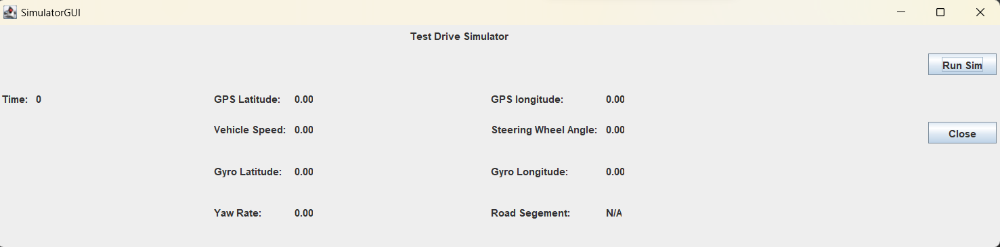

 Road Segment Detection

## How to Run

This project was developed on Intellij IDEA: 
1. Open the Test.java file.
2. Click the 'Run' Button
3. A GUI window named "Simulator GUI" will pop up
4.Click the "Run Sim" button to see the live data

